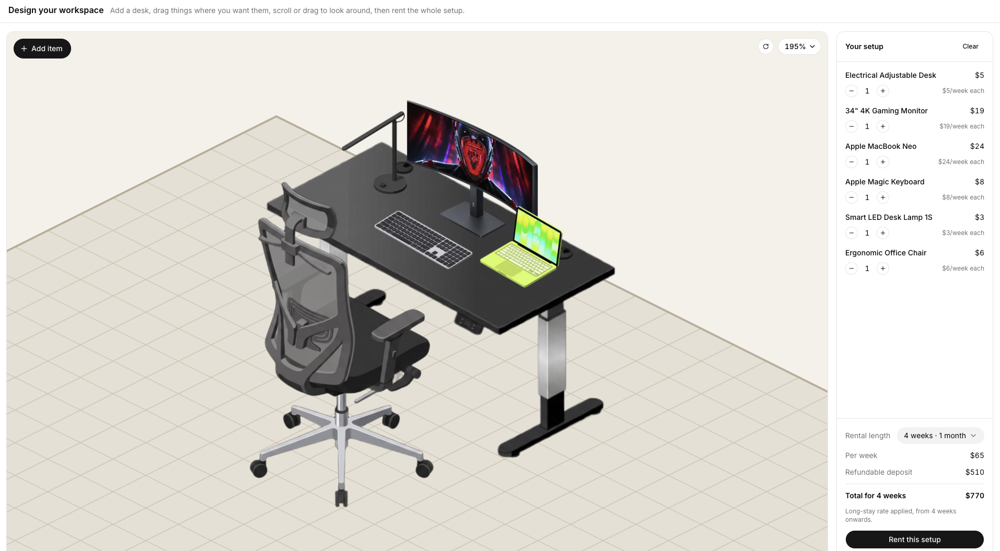
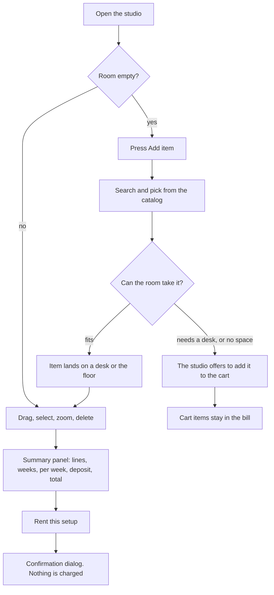
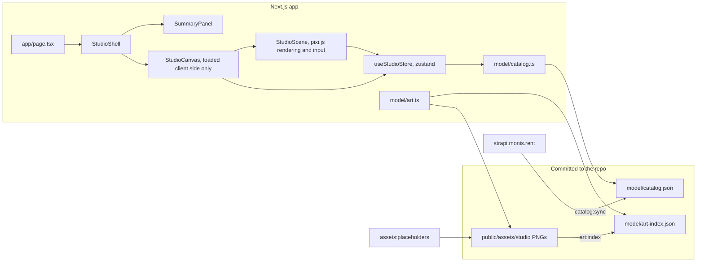

# Workspace Studio

[](https://github.com/lucky-ivanius/workspace-studio/actions/workflows/ci.yml)

Design a workspace out of rental gear from [monis.rent](https://monis.rent), watch the price as you build, and rent the whole setup. The room is a pixi.js canvas on an isometric grid. Pick a desk, drop a monitor on it, tuck a chair in front, drag things around, and check out.



## Features

### The room

- 24×24 tile floor on a 2:1 isometric grid. One tile is 20 cm, so an 8×4 tile desk is a 160×80 cm desk.
- Everything snaps to whole tiles. The store rejects illegal moves and the item stays where it was.
- Items stack. A monitor must fit inside its desk's surface area, chairs snap to the tile in front of a desk, and rugs are flat so other items can stand on them.
- Moving a desk carries everything standing on it. Deleting a desk sends its riders to the cart instead of dropping them from the bill.
- Pan by drag, zoom by wheel or pinch, and a zoom menu with 50%, 100%, 200% and fit. Shortcuts: `+`, `-`, `⇧0`, `⇧1`.

### The catalog

- Product data is synced from monis.rent into `src/features/studio/model/catalog.json`. The app never calls the API at build or request time.
- Add item opens a picker with search, category filters with counts, and "N added" badges. Each product has an info sheet with rates, specs, what's included and a storefront link.
- Products with no art yet, or items that don't fit in the room, go to the cart. Cart items are still billed.

### The price

- Every product carries the storefront's USD rates: per week, long-stay per week, and security deposit.
- From 4 weeks on, the long-stay rate applies.
- The summary panel lists per-product lines with quantity steppers, then the per-week subtotal, deposit, and total.

## Workflow



## Architecture



## Getting started

Requires Node 24 (see `.node-version`) and pnpm 12.

1. Install dependencies:

   ```bash
   pnpm install
   ```

2. Install the browser for the e2e tests, once:

   ```bash
   pnpm exec playwright install chromium
   ```

3. Start the dev server and open http://localhost:3000:

   ```bash
   pnpm dev
   ```

No environment variables are needed.

## Commands

| Command | What it does |
| --- | --- |
| `pnpm dev` | Dev server |
| `pnpm build` | Production build |
| `pnpm test` | Unit tests: grid, placement, store, pricing, art |
| `pnpm test:e2e` | Playwright browser tests, Chromium only |
| `pnpm typecheck` | `tsc --noEmit` |
| `pnpm lint` | Biome check |
| `pnpm format` | Biome format |
| `pnpm catalog:sync` | Re-sync product data from monis.rent |
| `pnpm art:index` | Re-index `public/assets/studio` |
| `pnpm assets:placeholders` | Draw stand-in art for missing PNGs |

## Testing

- Unit tests run on the node test runner via `pnpm test`. Six files cover the grid math, asset sizes, art resolution, placement rules, store semantics and pricing.
- E2E tests run in `e2e/studio.spec.ts` via `pnpm test:e2e`, 25 tests: the add flow, desk rules, cart offers, pricing across 1, 2, 4 and 12 weeks, drag, camera and zoom. Every test asserts zero console errors, so a broken asset or a runtime warning fails the suite.
- CI (`.github/workflows/ci.yml`) runs two jobs: lint, typecheck, unit tests and build; then the e2e suite against a fresh production build.

## Tech stack

Next.js 16, React 19, pixi.js 8, zustand 5, Tailwind CSS 4, Base UI with shadcn-style primitives, Biome for lint and format, Playwright for e2e.

## Further reading

- `docs/REQUIREMENTS.md`, the original brief
- `docs/FOUNDATION.md`, early architecture decisions
- `docs/ART-PROMPT.md`, how to draw isometric product art
